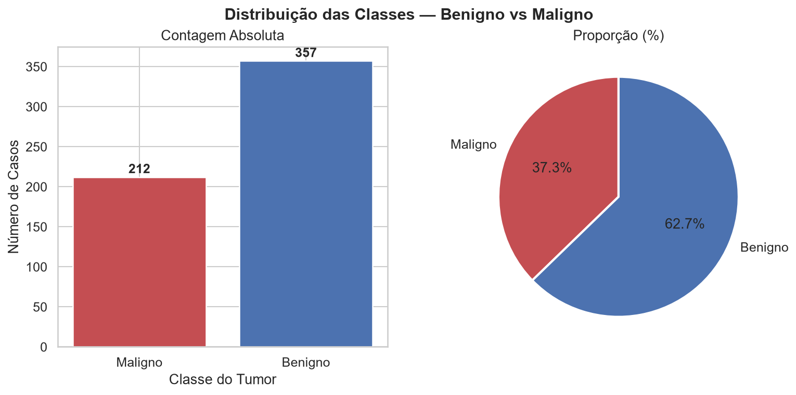
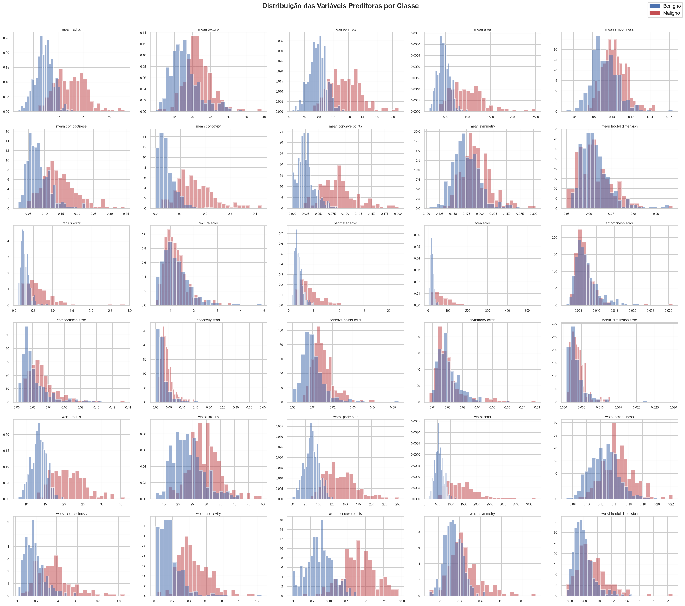
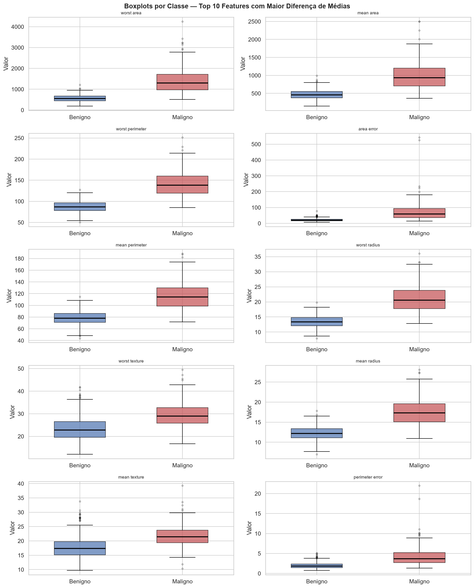
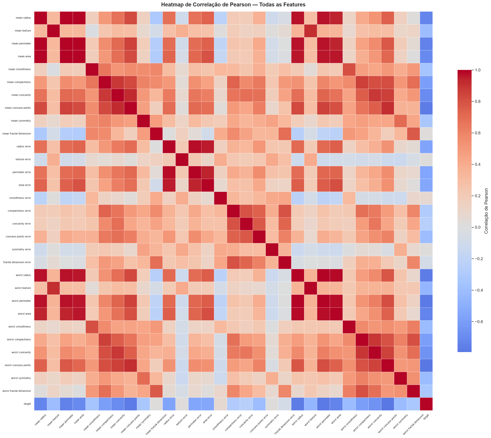
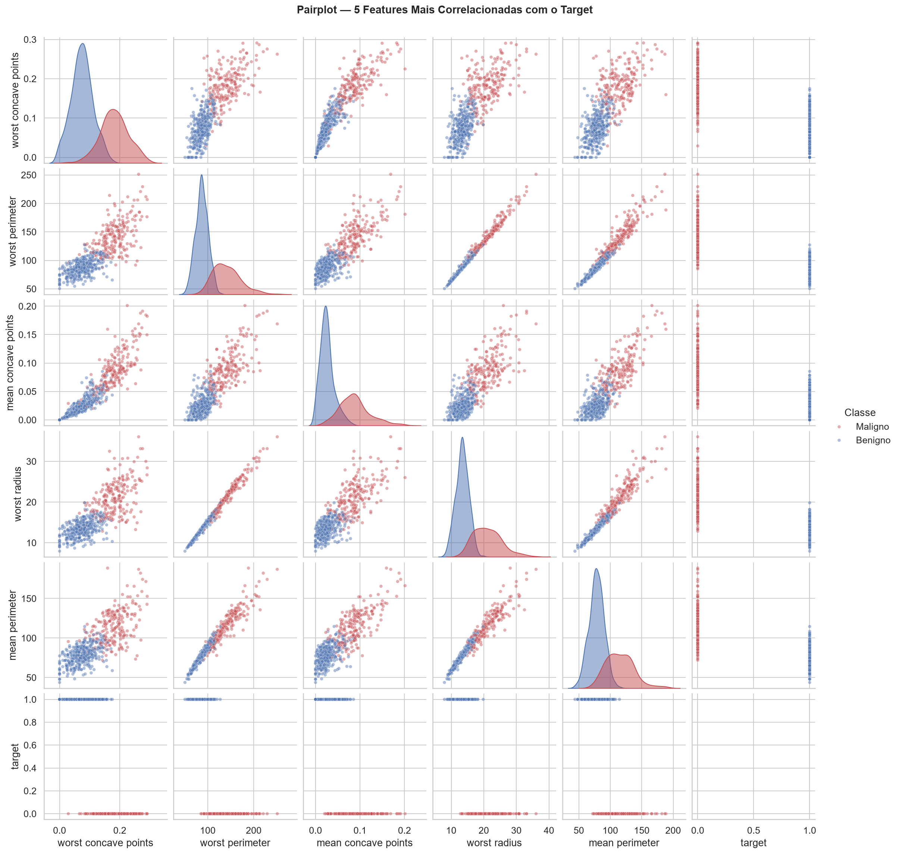

# Análise Exploratória de Dados
## Breast Cancer Wisconsin (Diagnostic)

Probabilidade e Estatística

Fonte: UCI Machine Learning Repository (ID 17)

---

## O Dataset

- **569 observações** (biópsias por agulha fina — FNA)
- **30 variáveis preditoras** contínuas
- **1 variável-alvo**: Diagnóstico → **Benigno (B)** ou **Maligno (M)**
- **0 valores ausentes**

Cada uma de **10 características-base** foi medida de **3 formas**:

| Sufixo | Significado |
|---|---|
| `mean` | Média dos núcleos celulares da imagem |
| `error` | Erro padrão (variabilidade entre núcleos) |
| `worst` | Média dos 3 piores (maiores) valores |

10 características × 3 formas = **30 features**

---

## As Features Mais Importantes

As 10 características-base medidas em cada núcleo celular:

- **radius** — distância média do centro ao perímetro
- **texture** — desvio padrão da escala de cinza
- **perimeter** / **area** — tamanho do núcleo
- **smoothness** — variação local do contorno
- **compactness** — perímetro² / área − 1.0
- **concavity** / **concave points** — reentrâncias do contorno
- **symmetry** — simetria do núcleo
- **fractal dimension** — irregularidade do contorno

---

## Destaque: Features Mais Discriminativas

Correlação de cada feature com o diagnóstico (target):

| Feature | \|correlação\| |
|---|---|
| **worst concave points** | 0.79 |
| **worst perimeter** | 0.78 |
| **mean concave points** | 0.78 |
| **worst radius** | 0.78 |
| **mean perimeter** | 0.74 |

➡️ Tumores malignos tendem a ter **maior tamanho** e **contorno mais irregular** (mais reentrâncias côncavas).

---

## Gráfico 1 — Distribuição das Classes

- **Benigno**: 357 casos (62,7%)
- **Maligno**: 212 casos (37,3%)

---

## Gráfico 2 — Histogramas das Features

- Mostra a distribuição de cada uma das 30 features, separada por classe (azul = benigno, vermelho = maligno)
- Onde as curvas se separam bem, a feature tem poder discriminativo
- Várias features de tamanho (`area`, `perimeter`, `radius`) mostram sobreposição pequena entre classes

---

## Gráfico 3 — Boxplots por Classe

- Top 10 features com **maior diferença de médias** entre Benigno e Maligno
- Caixas bem separadas (ex: `worst area`, `mean area`) indicam boa capacidade de distinguir as classes
- Pontos fora dos bigodes são outliers

---

## Gráfico 4 — Heatmap de Correlação

- Correlação de Pearson entre todas as 30 features
- **21 pares** com correlação ≥ 0.90 (ex: `mean radius` ↔ `mean perimeter`, r = 0.998)
- Indica **multicolinearidade**: várias features medem essencialmente a mesma coisa (tamanho do núcleo)

---

## Gráfico 5 — Pairplot das Top 5 Features

- Combina scatterplots das 5 features mais correlacionadas com o target
- Pontos azuis (benigno) e vermelhos (maligno) formam agrupamentos visualmente separados
- Confirma que essas features, combinadas, discriminam bem as classes

---

## Principais Conclusões da EDA

- Dataset **limpo** (sem nulos) e **moderadamente balanceado**
- Features de **tamanho** (`area`, `perimeter`, `radius`) e **forma** (`concave points`, `concavity`) são as mais discriminativas
- Alta **multicolinearidade** entre features do mesmo grupo → considerar PCA ou seleção de features
- Separação visual clara entre classes sugere que um modelo de classificação simples já teria bom desempenho

---

# Obrigado!

Dúvidas?
